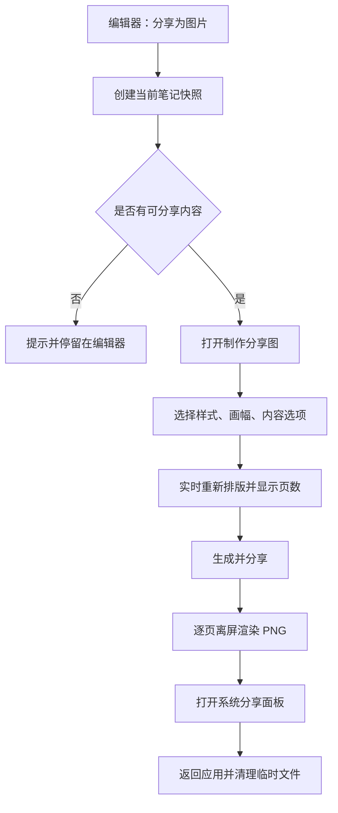
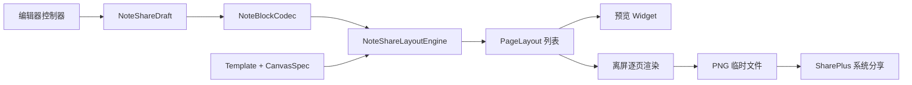

# 笔记图片分享：产品与技术设计

状态：设计评审稿
范围：分享制作页、模板体系、可配置画幅、分页渲染、系统分享、样式商店演进
暂不包含：公开笔记链接、云端模板编辑器、付费系统、社交关系

## 1. 产品定位

图片分享不是编辑器截图，而是把一篇笔记重新排版成可传播的“分享作品”。

核心价值：

1. 让笔记在微信、朋友圈、社交媒体、邮件等场景中保持清晰和美观。
2. 用信纸、信封、邮票等元素建立“非空笔记”的品牌记忆。
3. 允许用户选择样式、比例和内容信息，但不把制作过程变成复杂的设计工具。
4. 全程本地生成，不上传笔记内容，不产生公开链接。

设计原则：

- 内容优先：装饰不能降低正文可读性。
- 比例自由：模板必须响应式排版，不允许简单裁剪。
- 来源克制：每张图固定保留“非空笔记”来源，但不做侵入式水印。
- 预览可信：制作页展示的分页、换行和附件布局必须与导出结果一致。
- 本地优先：模板渲染和图片生成默认不访问网络。
- 渐进复杂：常用选项直接可见，高级选项按需展开。

## 2. 用户故事

- 我想把整篇笔记分享给朋友，并保持标题、列表、引用和图片的层级。
- 我想根据分享渠道选择方图、竖图、横图或长图。
- 我想快速切换不同风格，不需要自己调整每个装饰元素。
- 我想决定是否显示日期、标签和图片附件。
- 我想在分享前看到最终会生成几张图片。
- 我不希望笔记内容为了塞进一张图而被缩得很小。
- 我不希望分享图片包含本地文件路径、笔记 ID 或其他隐私数据。

## 3. 功能入口

首版入口放在编辑器右上角“更多”菜单：

- 分享为图片
- 封面设置
- 收藏 / 取消收藏
- 置顶 / 取消置顶
- 删除相关操作

“分享为图片”应位于菜单首项，因为它是内容操作，而不是笔记状态操作。

行为规则：

- 使用编辑器当前内存中的标题、正文、标签和附件创建不可变快照。
- 不等待自动保存，不要求笔记必须已经写入数据库。
- 标题、正文和附件全部为空时禁用入口，并提示“笔记还没有可分享的内容”。
- 回收站中的非空笔记仍允许分享。
- 正在听写时先使用已经提交到编辑器的内容；未确认的实时识别片段不进入分享图。

后续入口：

- 笔记列表卡片的更多菜单。
- 阅读模式右上角。
- 文本选区菜单中的“制作摘录卡片”，作为第二阶段功能。

## 4. 核心流程



制作页采用独立全屏页面，避免底部弹层在高预览图和键盘场景下空间不足。

页面结构：

1. 顶部栏：关闭、标题“制作分享图”。
2. 预览区：当前页预览、输出尺寸、页数、上一页/下一页。
3. 配置区：样式、画幅、内容、排版。
4. 底部主按钮：“生成并分享”。

小屏设备上下排列；平板和桌面端可使用左侧预览、右侧配置的双栏布局。

## 5. 默认视觉：一封非空来信

默认模板名称：“一封非空来信”。

视觉组成：

- 画布：使用主界面的灰米色 `AppColors.canvas`，保留极轻的纸纤维。
- 信纸：使用冷白 `AppColors.paperPrimary`、小圆角、细描边与轻纸影，与主页笔记卡片同源。
- 装饰：使用机械蓝的短线、圆点与角标，不使用信封折角、邮票或右上角应用图标。
- 标题：使用主界面同源的宋体 / 衬线标题和墨蓝色，最多展示三行，超过后正常分页而不是缩小。
- 正文：沿用笔记块级结构，段落、列表、引用和代码块分别设计。
- 页码：`01 / 03`，与邮戳组合，不遮挡正文。
- 来源：页脚固定显示品牌图形与 `来自「非空笔记」`。

多页变化：

- 完整笔记标题和日期只在第一页展示；后续页面使用紧凑的连续页眉。
- 中间页保持相同纸张语言，并减少非必要装饰，保证正文容量。
- 最后一页通过标签和来源栏形成视觉收束。
- 标签默认只出现在最后一页，避免与每页正文争夺空间。
- 所有页面的标题体系、来源和页码位置保持一致。

动效只存在于制作页预览：首次进入时信纸可轻微上移。导出图片不依赖动效。

## 6. 模板体系

样式选择采用单行横向滑动的纯文字标签，不使用图标。每套模板独立定义纸张比例、页边距、标题字重与对齐、背景、边框和装饰安全区；不是简单更换配色。所有内嵌纸张在画布中保持几何居中，视觉张力由纸内色块和装饰形成，不能通过把整张纸推向一侧制造偏置。

| 模板 | 视觉语言 | 适用内容 |
| --- | --- | --- |
| 一封非空来信 | 灰米画布、冷白纸张、机械蓝标记、衬线标题 | 随笔、日记、书信 |
| 素笺 | 高留白、弱边框、中性纸面 | 工作记录、教程、长文 |
| 夜读 | 深蓝黑渐变、暖金强调、低亮星点 | 诗歌、摘录、夜间随想 |
| 编辑部 | 瑞士编辑设计、居中纸张、黑色边栏与珊瑚色锚点 | 观点、评论、短文 |
| 晨刊 | 暖灰新闻纸、双线框、居中报头 | 时事摘要、周报、知识卡 |
| 方格稿 | 蓝灰横线、朱红页边、全幅纸面 | 手记、学习笔记、草稿 |
| 草木 | 鼠尾草绿、植物枝叶、柔和圆角 | 生活记录、自然、疗愈文字 |
| 蓝图 | 工程蓝网格、坐标标记、等宽标题 | 技术方案、产品设计、代码笔记 |
| 琥珀 | 日落棕渐变、暖金纸面、同心光晕 | 回忆、旅行、故事 |
| 胶片 | 黑灰颗粒、齿孔框架、红色焦点 | 影像随笔、电影记录、城市观察 |
| 远方明信片 | 航空条纹、邮戳线、海蓝纸边 | 旅行、见闻、寄语 |
| 美术馆 | 展签白、居中构图、色块编号系统 | 艺术笔记、作品说明、极简摘录 |
| 霓虹 | 黑紫背景、完整青紫渐变光框 | 音乐、科技、夜生活 |
| 潮汐 | 冰蓝渐变、低对比波纹、漂浮纸面 | 海边记录、平静长文、散文 |
| 朱印 | 米色宣纸、朱红竖线与方印 | 古诗、传统文化、读书摘录 |

所有模板必须支持普通画幅、横竖方向、长图和三档排版密度；底栏前固定保留呼吸区，并通过统一度量安全线消除字体取整导致的溢出。

## 7. 画幅系统

画幅是独立于模板的一级能力。每个模板必须支持所有普通画幅；装饰根据可用空间响应式重排。

### 7.1 预设

| 预设 | 默认方向 | 主要用途 |
| --- | --- | --- |
| 1:1 | 方形 | 头像流、短摘录、通用卡片 |
| 4:5 | 竖向 | 社交平台信息流 |
| 3:4 | 竖向 | 默认笔记卡片 |
| 9:16 | 竖向 | 手机全屏、故事场景 |
| 16:9 | 横向 | 演示、横屏阅读 |
| A4 | 竖向 | 文档式分享、打印预览 |
| 长图 | 竖向 | 连续阅读 |
| 自定义 | 继承输入 | 特殊渠道和设计需求 |

方向控制：

- 普通预设支持竖向和横向互换。
- 选择 `9:16` 自动切换竖向，选择 `16:9` 自动切换横向，用户仍可手动反转。
- 长图仅支持竖向。
- 自定义像素模式下，切换方向会交换宽高。

### 7.2 输出尺寸

比例预设使用“短边清晰度”：

- 标准：1080 px。
- 高清：1440 px。
- 超清：2160 px，仅在设备能力允许时提供。

自定义模式直接输入宽度和高度：

- 最小边：480 px。
- 最大宽度：4096 px。
- 最大单页高度：12000 px。
- 最大像素数：20 MP；超过后提示调整尺寸或自动分页。

制作页始终显示最终像素尺寸，例如 `1080 × 1440`，不只显示比例名称。

### 7.3 长图

长图不是无限高画布：

- 先根据内容计算理想高度。
- 同一笔记在内容开关、密度和清晰度不变时，切换模板不得改变最终像素尺寸；布局引擎使用所有内置模板中的最大安全高度作为统一画布高度。
- 高度在安全阈值内时生成单张长图。
- 超过设备纹理或内存安全阈值时，自动拆成连续长图，并在生成前明确显示张数。
- 拆分位置遵守块级分页规则，不能在图片中间或单行标题后切断。

## 8. 配置项

### 8.1 样式

- 模板选择。
- 模板配色：仅显示模板设计者提供的 3–5 个安全配色，不提供任意颜色导致对比度失控。
- 最近使用的模板排在首位。

### 8.2 内容

- 显示标题：默认开启。
- 显示日期：默认开启，可选创建日期、更新日期或不显示。
- 显示标签：有标签时默认开启。
- 显示图片附件：有图片时默认开启。
- 显示非图片附件：默认开启，以信息条形式展示名称和类型。
- 来源标识：固定开启，不提供关闭入口。

首版分享整篇笔记。仅分享选中文本作为后续“摘录卡片”独立流程，不与全文分享混在一起。

### 8.3 排版

- 排版密度：舒展、标准、紧凑，默认标准。
- 图片布局：题图、穿插、隐藏；只有存在图片时显示。
- 页边距：由模板和排版密度共同决定，不提供像素级滑杆。

避免首版开放字号、行距、边距、圆角等大量独立滑杆。用户需要的是灵活选择结果，而不是重新完成一次平面设计。

### 8.4 记忆策略

在本地记住：

- 最近使用模板。
- 最近使用比例与方向。
- 清晰度。
- 排版密度。
- 内容开关。

不同模板可以记住各自配色，但比例与内容选项全局共享。制作页提供“恢复推荐设置”。

## 9. 内容映射

使用现有 `NoteBlockCodec.decode` 将 Markdown 转换为 `NoteBlockData`，分享渲染器消费不可变块列表。

| 笔记块 | 分享图表现 |
| --- | --- |
| paragraph | 正文段落，保留行内粗体、斜体、删除线、下划线 |
| heading | 分级标题；一级标题不能与笔记标题竞争视觉层级 |
| bullet | 圆点列表，保留缩进层级 |
| ordered | 数字列表，跨页后继续编号 |
| todo | 只读复选框和文字，保留完成状态 |
| quote | 品牌色竖线和弱色文字 |
| code | 等宽字体、浅色代码底，允许按行分页 |
| rawMarkdown | 使用现有 Markdown 只读渲染规则；表格必要时缩列或拆成信息行 |
| divider | 细分隔线 |
| attachment image | 题图或正文图片 |
| attachment audio/video/document | 文件类型、显示名称和可选时长，不包含本地路径 |

链接只表现为带下划线或强调色的文字。图片不可点击，因此不显示完整 URL，除非 URL 本身就是笔记正文。

附件异常：

- 文件不存在：导出前显示“1 个附件无法读取”，允许继续但不渲染缺失文件。
- 图片解码失败：显示中性占位卡，不中断其他页面。
- 附件显示名称优先于原始文件名。
- 永远不输出 `filePath`、数据库 ID、内部资源键或 OCR 调试信息。

## 10. 分页规则

分页由布局引擎根据模板、画幅、排版密度和实际字体测量结果计算，不能按字符数粗略截断。

规则优先级：

1. 每页预留模板安全区、标题区和来源页脚。
2. 标题至少与后续两行正文共同出现，避免孤立页尾标题。
3. 普通段落优先整块放置；过长时按行拆分，页首和页尾至少保留两行。
4. 列表项尽量保持完整；单个超长列表项可以按行拆分。
5. 引用块可以拆分，但每页重复引用视觉标记。
6. 代码块按完整代码行拆分，禁止在一行中间换页。
7. 图片不可从中间裁断；空间不足则移动到下一页并重新计算尺寸。
8. 附件信息条不可拆分。
9. 每页固定显示来源；页码只在总页数大于一时显示。
10. 完整标题和日期属于第一页，标签属于最后一页；中间页只保留紧凑连续页眉。
11. 配置变化后取消旧的分页任务，只呈现最新结果。

预览分页计算可以异步执行，并使用短防抖避免用户连续切换比例时反复测量。

## 11. 来源与品牌规则

每张图片必须包含来源，不允许模板遮盖或移除。

中文：

`来自「非空笔记」`

英文及其他语言：

`Created with FKNotes · 非空笔记`

规则：

- 使用品牌图形加文字，不单独使用难以辨认的图标。
- 位于页脚安全区，字号不小于正文的 65%。
- 与正文保持足够对比度。
- 不添加用户标识、设备标识、追踪参数或不可见水印。
- 暂不添加下载二维码；未来存在正式公开落地页后再作为可选项评估。

## 12. 制作页状态

### 12.1 就绪

- 首屏立即显示默认模板预览。
- 顶部显示像素尺寸和页数。
- 生成按钮可用。

### 12.2 重新排版

- 只在预览区域显示轻量进度，不遮挡整个页面。
- 保留上一版预览，完成后平滑替换，避免闪白。

### 12.3 生成图片

- 主按钮进入忙碌状态，显示“正在生成 2/4”。
- 用户可以取消尚未完成的生成任务。
- 防止重复点击创建多个并发渲染任务。

### 12.4 系统分享

- 使用系统分享面板，不在应用内维护分享目标列表。
- 多页按顺序一次分享，文件名包含补零序号。
- iPad 使用触发按钮位置作为系统弹层锚点。

### 12.5 失败

- 内存不足：自动降低到高清或标准尺寸，先征求用户确认。
- 单个附件失败：允许忽略附件继续。
- 图片编码失败：保留制作页配置并提供重试。
- 系统分享取消不视为错误，不弹失败提示。

## 13. 隐私与安全

- 生成完全在本地执行。
- 分享文件写入应用临时目录，不进入永久附件目录。
- 分享完成、取消或超时后进行尽力清理；应用下次启动时再次清理过期分享缓存。
- PNG 不写入 EXIF、GPS、数据库 ID 或本地路径。
- 图片附件按当前像素方向正确旋转，但不复制原图元数据。
- 外部模板只能提供声明式配置和静态资源，不能执行 Dart、JavaScript、HTML 或着色器代码。
- 远程模板包必须校验签名、哈希、文件数量和解压后大小，拒绝路径穿越。

## 14. 无障碍

- 制作页控件遵循系统文字缩放；预览画布保持输出比例，但允许单独放大查看。
- 预览提供语义描述，例如“3:4 分享图，第 1 页，共 3 页”。
- 模板缩略图同时显示名称，不能只靠颜色区分。
- 选中状态同时使用描边、勾选和语义状态。
- 所有内置配色进行正文、次要文字、引用和页脚对比度检查。
- 动效遵循系统“减少动态效果”设置。

## 15. 技术架构

建议模块：

```text
lib/
  models/
    note_share_draft.dart
    note_share_template.dart
  pages/
    note_share_composer_page.dart
  services/
    note_share_layout_engine.dart
    note_share_image_service.dart
    note_share_preferences_service.dart
    note_share_template_repository.dart
  widgets/
    note_share_preview.dart
    note_share_page_canvas.dart
    note_share_block_view.dart
    note_share_controls.dart
```

职责：

- `NoteShareDraft`：编辑器当前内容的不可变快照和用户配置。
- `NoteShareTemplate`：模板元数据、能力和主题令牌。
- `NoteShareLayoutEngine`：块测量、分页和每页布局结果。
- `NoteSharePageCanvas`：根据页面布局结果绘制一页。
- `NoteShareImageService`：离屏渲染、PNG 编码、文件命名、临时目录管理。
- `NoteShareTemplateRepository`：内置模板、已下载模板和版本兼容。
- `NoteSharePreferencesService`：记住用户最近配置。

数据流：



渲染要求：

- 预览和导出复用同一个页面画布组件及布局结果。
- 逻辑尺寸与输出像素解耦，根据目标输出尺寸计算像素倍率。
- 页面逐张渲染和编码，完成一张即释放中间图像对象，控制峰值内存。
- 多页文件名示例：`fknotes-note-title-01-of-03.png`。
- 生成任务使用唯一会话目录，避免并发任务覆盖。

## 16. 模板与样式商店

首版页面称为“更多样式”，不承诺完整商店。模板系统从第一天采用可扩展清单。

建议模板包字段：

```json
{
  "id": "fknotes.letter.classic",
  "version": 1,
  "minAppVersion": "1.1.0",
  "renderer": "letter",
  "name": {"zh": "一封非空来信", "en": "A Letter"},
  "capabilities": ["allRatios", "images", "code", "darkPalette"],
  "palettes": ["warm", "sage", "rose"],
  "assets": ["paper.webp", "stamp.svg"],
  "sha256": "...",
  "signature": "..."
}
```

限制：

- `renderer` 只能引用应用内置且受控的渲染器。
- 模板包只能调整安全主题令牌、装饰资源和能力开关。
- 字体资源必须包含许可证信息，并限制单包体积。
- 模板不兼容当前版本时保留用户选择记录，但回退到内置“素笺”。
- 删除已下载模板不影响使用该模板生成过的图片。

演进：

1. 三个内置免费模板。
2. 本地“更多样式”目录、收藏和最近使用。
3. 签名远程目录、下载与更新。
4. 有真实需求后再评估创作者和付费能力。

## 17. 性能预算

- 打开制作页后 300 ms 内显示初始骨架或可用预览。
- 普通 3:4 单页标准图目标在 1 秒内完成编码。
- 4 页标准图目标在 3 秒内完成；较慢设备显示逐页进度。
- 分页计算不能阻塞编辑器返回动画。
- 图片解码使用目标尺寸采样，禁止把超大原图完整解码后再缩小。
- 超清选项根据设备内存能力降级或隐藏。

性能目标是产品预算，最终以 Android 中端模拟设备和一台真实 iPhone/Android 设备实测校准。

## 18. 测试计划

单元测试：

- 画幅、方向和像素尺寸计算。
- 自定义尺寸限制和最大像素数。
- 段落、列表、引用、代码和附件分页。
- 页码、文件名和分享顺序。
- 临时目录过期清理。
- 模板清单解析、版本和安全校验。

Widget 测试：

- 编辑器入口和空笔记禁用。
- 当前未保存内容进入快照。
- 比例、方向、样式和内容开关更新预览。
- 长图限制横向。
- 来源标识不可关闭。
- 生成中防止重复操作和允许取消。

Golden 测试：

- 三个内置模板 × 1:1、3:4、9:16、16:9。
- 中文、英文、emoji、长标题、长英文单词。
- 各 Markdown 块类型。
- 无图片、单图、多图、损坏图片和缺失附件。
- 深浅系统主题下的制作页 UI；导出图片由模板配色决定，不跟随系统主题漂移。

集成测试：

- Android/iOS 单图分享。
- 多图顺序。
- iPad 分享锚点。
- 分享取消和临时文件清理。
- 低内存降级流程。

## 19. 首版范围

首版必须完成：

- 编辑器“分享为图片”入口。
- 独立制作分享图页面。
- 一封非空来信、素笺、夜读三个模板。
- 1:1、4:5、3:4、9:16、16:9、A4、长图和自定义尺寸。
- 竖向/横向、标准/高清清晰度。
- 标题、日期、标签、图片和附件开关。
- 排版密度。
- 自动分页、多图分享和固定来源标识。
- 本地偏好记忆、临时文件清理、失败重试。
- 中英文文案和关键测试。

首版不做：

- 远程样式商店。
- 付费模板。
- 用户自由拖拽元素。
- 自定义字体上传。
- 公开笔记链接和二维码。
- 摘录选区卡片。

## 20. 验收标准

1. 同一篇笔记切换任意支持画幅时不裁剪正文，页数实时正确更新。
2. 标准字体下不存在正文溢出、页脚遮挡、图片截断和孤立标题。
3. 每张导出图片均包含清晰可读的“非空笔记”来源。
4. 预览与最终 PNG 的分页、换行和装饰位置一致。
5. 未保存的当前编辑内容可以正确分享。
6. 单图和多图均能通过 Android、iOS 系统分享面板发送。
7. 分享图片不包含文件路径、数据库 ID、EXIF 定位等隐私数据。
8. 生成失败不会丢失笔记内容或制作页配置。
9. 三个模板在方形、竖向、超长竖向和横向场景下都有经过设计的响应式布局。
10. 当前应用启动、编辑、自动保存、删除和附件流程不受影响。
